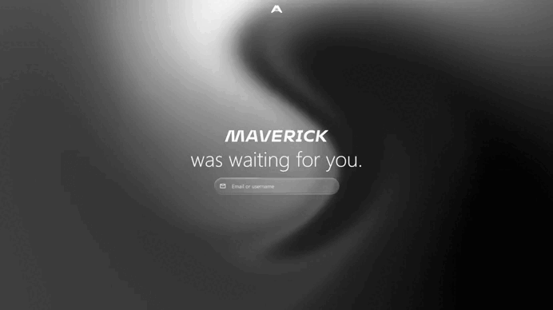

# Maverick

Maverick is an AI agentic operating system for companies that want to delegate real digital work to AI agents without losing ownership, boundaries, or extensibility.

Most business operations are fragmented across SaaS tools, documents, inboxes, internal dashboards, scripts, credentials, and one-off automations. Maverick gives those pieces one governed operating layer: workspaces, apps, widgets, skills, providers, databases, CLI commands, and MCP tools become first-class building blocks for agentic operations.

Everything you create is already connected. An app created in Maverick or installed from the App Store is not another isolated SaaS island: once enabled in a workspace, its declared surfaces become part of the same context that agents and other apps can discover and use. Agents can work through the apps, the apps can compose with each other, and the workspace stays the center of gravity.

<p align="center">
  
</p>

Adios fragmentation.

Maverick is for teams building internal AI operations, agent-native business tools, self-hosted automation platforms, or company-specific AI workspaces.

Maverick is not production-ready yet. Use it for local evaluation, development, and architecture review. Do not expose it to the public internet or store production secrets in it until the security roadmap is complete.

## Principles

- **Connected by default:** apps created locally or installed from the App Store join the workspace graph through explicit contracts, so agents and apps can use approved frontend, backend, CLI, MCP, widget, skill, reference, and lifecycle surfaces without custom glue code.
- **Delegation over chat:** chat is only one interface. Maverick treats AI as an operator that can use apps, widgets, CLI commands, MCP tools, provider runtimes, and workspace-owned skills.
- **Workspace isolation first:** workspace data, app data, runtime material, generated files, logs, and policy decisions stay scoped to the workspace they belong to.
- **App contracts over core patches:** apps own product behavior; the core stays headless, platform-oriented, and app-agnostic.
- **Explicit governance:** agents should be powerful, but not invisible. Maverick favors permissions, workspace policy, scoped secrets, auditable surfaces, and recoverable operator flows.
- **Provider and database independence:** Codex and JSON are the default local path today, but provider and persistence layers are adapter-based.

## Quick Start

Maverick is easiest to evaluate from a clean clone. The default setup is local and CLI-first: it gives you the platform core, bundled apps, JSON persistence, and a local ASGI host without requiring MongoDB or external infrastructure.

Requirements:

- Linux
- Python 3.12, including the `venv` package
- Node.js and npm
- `bubblewrap` for sandbox verification
- Codex CLI for the default Codex-backed runtime path

On Ubuntu:

```bash
sudo apt-get update
sudo apt-get install -y python3.12 python3.12-venv bubblewrap
```

Run Maverick locally:

```bash
git clone https://github.com/PeterPsy/Maverick.git maverick
cd maverick

./scripts/bootstrap_local.sh
source .venv/bin/activate
./scripts/verify_local.sh
./scripts/run_local.sh
```

In another terminal:

```bash
curl http://127.0.0.1:8000/health
```

Most committed app frontend artifacts are already present. To rebuild app frontends during bootstrap:

```bash
./scripts/bootstrap_local.sh --build-frontends
```

For local service installs, hosted evaluation, MongoDB, nginx, certbot, systemd, and admin-password details, use:

- `docs/deployment/local_setup.md`
- `docs/deployment/self_hosted_evaluation.md`
- `docs/deployment/systemd_nginx.md`

## What Maverick Provides

- **Core:** identity, sessions, workspaces, app mounting, runtime orchestration, provider selection, persistence adapters, secrets, recovery, and platform HTTP/CLI/MCP APIs.
- **Workspaces:** tenant boundaries for app data, runtime material, logs, uploads, generated files, and workspace-local apps.
- **Apps:** product behavior packaged under `apps/<app_id>/` with an `app_contract.json`.
- **Widgets:** small app-owned surfaces that can render inside other apps without source imports.
- **Runtime agents and skills:** provider-backed agent sessions that use workspace-owned skills and runtime roots.
- **Provider abstraction:** Codex is the default concrete runtime backend today; future providers should fit behind the same provider/runtime boundary.
- **Persistence abstraction:** JSON is the default local control-plane adapter; MongoDB is optional for hosted evaluation.

## Apps Are The Integration Layer

Apps are how Maverick grows. A CRM, memory graph, gallery, chat surface, admin panel, document workflow, or company-specific tool should be an app, not a core patch.

An app can provide frontend, backend, CLI, MCP, lifecycle hooks, widgets, skills, reference entities, view surfaces, and storage behavior. The platform mounts and governs those capabilities through the app contract.

That contract makes new software immediately useful to the rest of the workspace. A locally created app or an App Store install can expose tools to agents, widgets to other apps, skills to runtime sessions, and backend/CLI/MCP actions to the governed platform surface. The result is one centralized operating layer instead of another disconnected tool.

## CLI And MCP

Maverick is designed for both humans and agents. CLI and MCP surfaces are scoped and discoverable.

Core discovery:

```bash
maverick core cli list --json
maverick core mcp list --json
```

App discovery:

```bash
maverick apps list --json
maverick app <app_id> cli list --json
maverick app <app_id> mcp list --json
```

This keeps agents from loading every app and platform surface at once.

## App SDK

The App SDK is the path for extending Maverick without copying an existing app or weakening the core boundary.

```bash
maverick core cli run core.app-sdk.create --app-id <app_id> --template-id <template_id> --json
maverick core cli run core.app-sdk.validate --app-id <app_id> --json
maverick core cli run core.app-sdk.install-local --app-id <app_id> --json
maverick app <app_id> frontend build --json
```

## Repository Layout

```text
.github/     GitHub workflows and repository metadata.
apps/        Built-in app packages and app contracts.
core/        Maverick platform core package root.
docs/        Architecture, SDK, deployment, security, and reference docs.
scripts/     Developer, verification, install, and deployment helpers.
tests/       Python test suite.
```

Generated local/runtime directories such as `workspaces/`, `data/`, `logs/`, `.maverick/`, and `.venv/` are not source directories.

Some built-in apps commit `frontend/dist/` so a clean checkout can mount them without a frontend build step. Generated artifact policy is documented in `docs/development/generated_artifacts.md`.

## Documentation

Start here:

- `docs/deployment/local_setup.md`
- `docs/deployment/self_hosted_evaluation.md`
- `docs/security/threat_model.md`
- `docs/reference/persistence_model.md`
- `docs/reference/runtime_provider_model.md`
- `docs/reference/core_surfaces.md`

Architecture source of truth:

- `docs/architecture/core_architecture.md`
- `docs/architecture/workspace_root_architecture.md`
- `docs/architecture/app_contract_architecture.md`

Project status and contribution expectations:

- `ROADMAP.md`
- `SECURITY.md`
- `CONTRIBUTING.md`
- `GOVERNANCE.md`

If code and docs disagree, fix the disagreement in the same change.

## Current Limitations

Maverick is moving toward a self-hostable platform for real company operations, but this repository is still pre-production software.

- Maverick is experimental and not production-ready.
- Public internet deployment is not supported for sensitive use.
- Security hardening remains incomplete.
- App frontend/backend isolation is still being hardened.
- Production secret handling is still evolving.
- Codex is the only fully exercised runtime backend today.
- Docker and broad setup UI flows are not the recommended first public install path yet.

## License

Maverick is released under the MIT License. See `LICENSE`.
